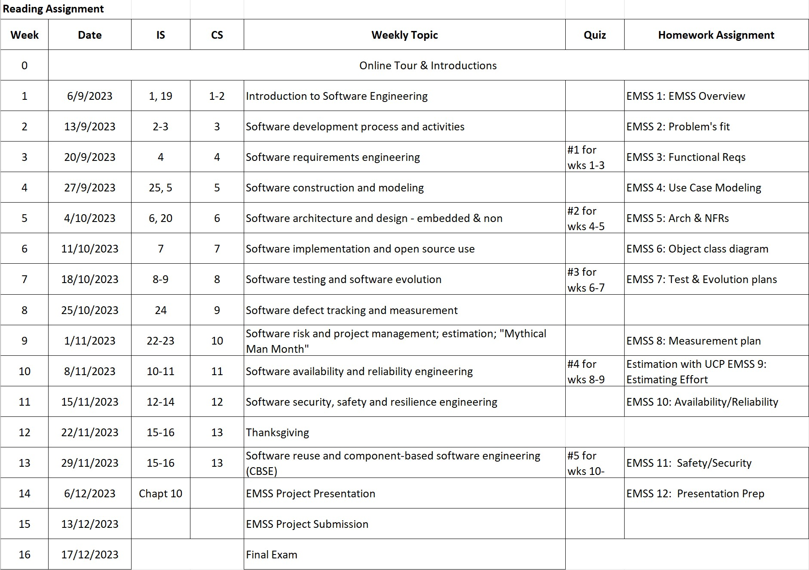

# SSW 540 - Fundamentals of Software Engineering

**Welcome to Fundamentals of Software Engineering.**  
 
Professor: [Raz Saremi, Ph.D.](mailto:rsaremi@stevens.edu)  
 
Available for virtual office meetings or by appointment  

## IMPORTANT COURSE INFO - PLEASE READ

We use a primary textbook in this course: [Ian Sommerville's Software Engineering, 10th Edition](https://www.amazon.com/Software-Engineering-10th-Ian-Sommerville/dp/0133943038/ref=sr_1_1?keywords=Ian+Sommerville%27s+Software+Engineering&qid=1641488883&sr=8-1)  
 
Group Project Assignments are due on Wednesday at 11:59 pm. Bi-Weekly Quizzes are due Sunday at 11:59 pm. Canvas does not permit students to take quizzes after their due date/time. If you must miss a quiz, please arrange with the professor for an alternative before the due date.  
 
There are assignments for each week. For each day late, I will subtract 5% from assignment submitted after their due date. When warranted, extensions will be granted before assignments are due.  
 
Each week's lecture slides will be posted on Canvas and recorded during the session for your later review. Since the classroom time will be divided between lecture and hands-on work, it's very important that youcread the assigned textbook cahpters BRFORE the online lecture.  
 
An open book quiz is given about every 2nd week, covering that and the previous weeks' material since the last quiz.  
 
Each week students will prepare and submit a group assignment. Part of the classroom activity will be devoted to hands-on work on the weekly group assignment. You will be asked to evaluate your teammates at the end of the course on the quality and quantity of their contributions. Be a good teammate and your group will prosper!  
 
If you have any questions, [email me](mailto:rsaremi@stevens.edu). I strive to return all emails within 24 hours.  
 
I look forward to a great term!

## Course Overview

Each week...

* Lecture and class activites, intermingled
* Text and other assigned reading
  * Sommerville, Ian, Software Engineering, **10th Edition**, Addison Welsey, 2016, ISBN-10: 0-13-394303-8; ISBN-13: 978-0-13-394303-0
  * Severance, Charles, Python for Everybody: Exploring Data in Python 3. [Download](http://www.pythonlearn.com/book.php)
* Small Python assignment
* Topical assignment building to finalize project
* About every other week: mini-exam/online quiz

**Use your course schedule!**

## Weekly Course Topics

1. Introduction to Softweare Engineering
2. Software development processes and activities
3. Software requirements engineering
4. Software construction and modeling
5. Software architecture and design
6. Software implementation and UML/SysML
7. Software testing and evolution
8. Software defect tracking and estimation
9. Software project management
10. Software dependability and reliability engineering
11. Software dependability: safety, security and resilience engineering
12. Software reuse and component-based software engineering (CBSE)
13. Final project readouts

## Grading Scheme

Group Project Assignments: 40%  
Bi-Weekly Quizzes: 20%  
Final Exam: 40%  

## Course Schedule

